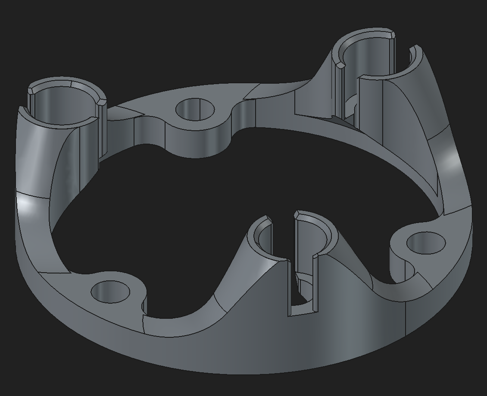

Author: relikd

Based on: `original`

---

Main benefits:
- easier spring changes (unscrew without having to remove the magnets)
- easier magnets dis-/assembly (unscrew first, then handle magnets)
- easy to replace your existing `magnets-holder`

To replace your existing `magnets-holder`, you only need a new `spring`.
In the original spring, the center holes are pointing in the same direction as the holes on the outside ring.
For this `magnets-holder-v2`, they need to point in the opposite direction:

(I've added a variable option to all spring models)

__Note:__ The magnets require a press-fit.
If they fall out, adjust the magnets-diameter variable.
