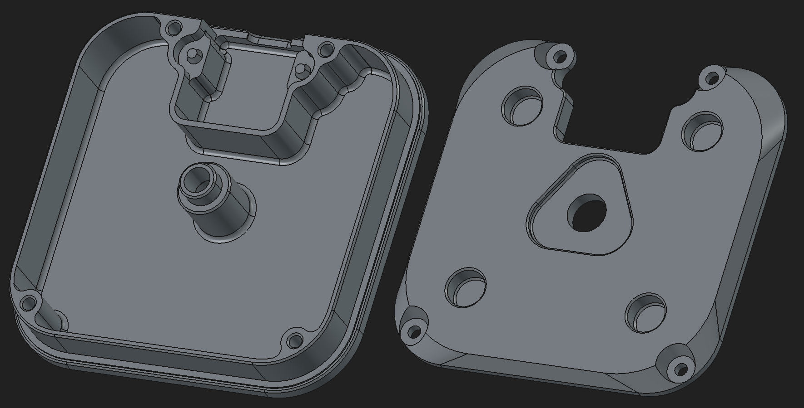
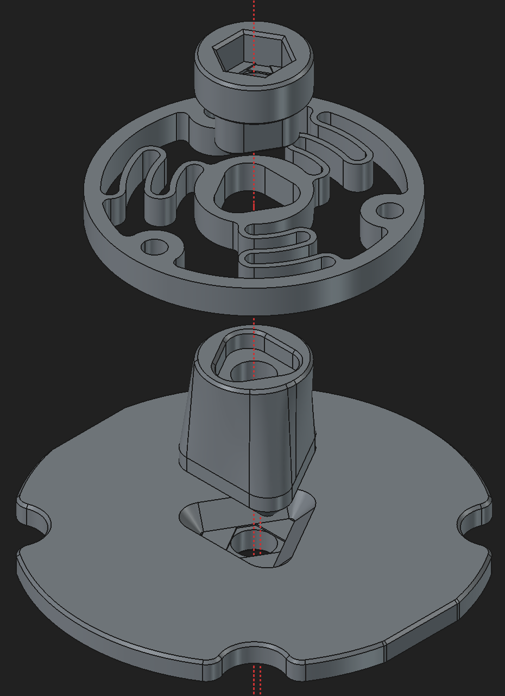

Author: relikd

Based on: `original` + `print-improvements`

---

Re-designed to assemble all parts with a single center screw (M5) while maximizing bottom volume for weights.

### Changes

- All heights are calculated from sensors board + MCU dimensions.
  This assures a minimal possible height and allows customizations for custom PCB designs.
- The `Top` and `Bottom` are fixed with self-tapping screws (no heat-set inserts needed, just regular 3mm).
- The model files `Top`, `Button`, and `Diffuser` have variant options (screw type and PCB variants (see below).
  All models have `VarSet` variables.

#### PCB variants

- Original (PCB design by [sb-ocr](https://github.com/sb-ocr/cad-mouse-mk2), the original release)
- Nikki (PCB design by [sheffieldnikki](https://github.com/sb-ocr/cad-mouse-mk2/issues/24), community variant, mounting the MCU directly onto the sensors board)

#### Re-used parts

- from `print-improvements`:
	- `knob`
- from `original`:
	- `magnet-holder`

### Print settings

- The model is tweaked for a minimum layer height of 0.2mm.
  Try not to go above or else you will have overhangs in screw holes etc. (or: adjust the printer variables in the model files)
- Only `Top` needs supports.
  All other parts have bridges for overhangs and should print without supports.

### Steel plate weight

Use `template-bottom-weight.dxf`, if you want to cut the weights from a steel plate.
The maximum possible height is 12.2mm - you can cut 3x 4mm plates or 2x 5mm.

### Bill of materials

I've included a range of possible screw lengths, just so you can re-use some scrap screws laying around.

- 6x Magnets 6mm x 3mm (same as original)
- 1x M5 x 40, Hexagon Socket Head Cap Screw
- 1x M5 nut
- 3x M3 x 10-12mm (`Knob`)
- 3x M3 Heat-Set Inserts 4mm (`Knob`)
- 4x M3 x 5-12mm (or Self-Tapping screws), sink head or another flat head with a low profile (<2mm)
  (connects `Separator` to `Bottom` and *may* collide with `Top` if head sticks out too much)
- 4x M3 x 4-7mm  (or Self-Tapping screws), any flat head type will do (connects PCB to `Top`)

Self-tapping screws are fine, because you won't need to open these parts very often (if ever).
Even if you do, a few screwing - unscrewing cycles should be fine.

Instead of self-tapping screws, you can use M3 screws *without* heat-set inserts, they will hold fine as well.
I still recommend heat-set inserts for the `Knob` as you might need to replace the `Spring` regularly.

If you use heat-sets for the top, you should adapt your hole size variable (e.g., 4.4mm).

### Assembly

The mouse consists of three main parts: bottom, top, and knob.

1. Fill the `Bottom` with weights (e.g., steel balls), fill it up with wax and then close it off with the `Separator`.
2. Place the `Diffuser` in the `Top` shell (the diffuser cut-out should point in the same direction as the USB port).
   Place the PCB onto the diffuser (pinout in the same direction).
   Then, screw both together and insert the MCU.
3. Combine the `Stem`, `Spring`, and `Nut-Cage`.
   Place the M5 nut into the cage.
   Combine this stack with the `Magnet-Holder` and fix both into the `Knob`.
4. Finally, stack all three components loosely together and insert the M5 screw carefully.
   Don't push too hard, or the nut will fall out (and you'll have to disassamble the knob again).

The single M5 screw holds all parts together.
Most parts have a tight fit.
Especially the spring and stem should fit as perfect as possible (reduces rotational wobble).
