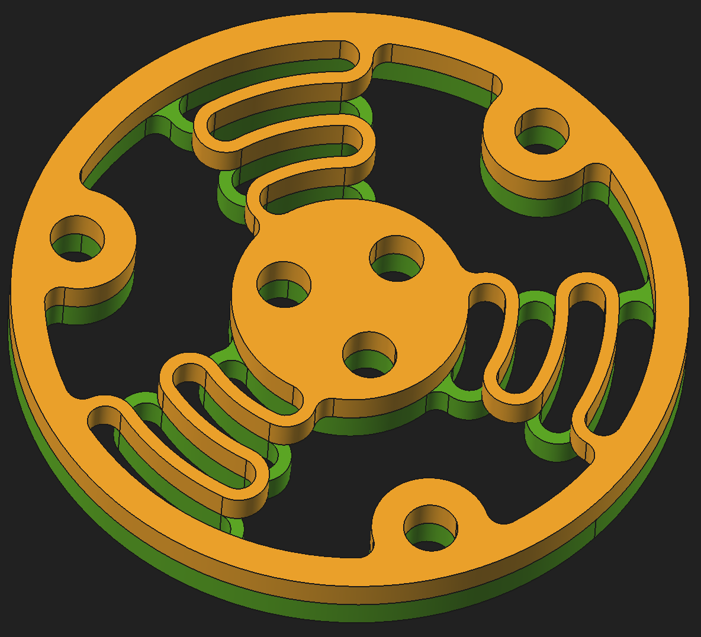

Author: relikd

Based on: `original` or `single-center-screw`

---

With the original spring, you'll feel a different torque for left vs. right rotation.
This spring variant tries to fix this difference by adding a flipped shape.

#### Spacer

If you use a thinner spring, you should match the height with a spacer:
`spring` + `spacer` = 4mm.

### Alternative

Alternatively, print the original spring two times – with half the height (2x 2mm).
Mount them together, such that one side is flipped upside-down.
You'll get the same benefit as the torque fix with an additional benefit for the Z-axis.
Up and down motion will be softer and you won't lift your mouse if the weights are too light.

Disadvantage: the spring will probably break / degrade faster.

### Batch export

The Makefile is just a wrapper around `freecad -c export.py`
