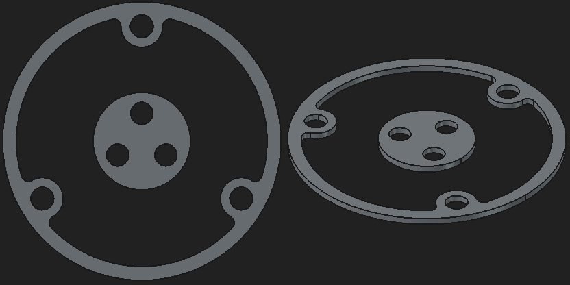
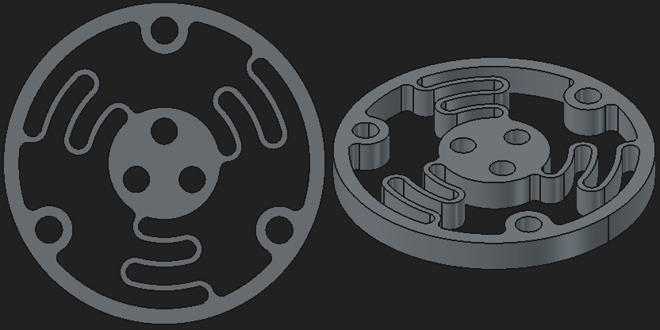
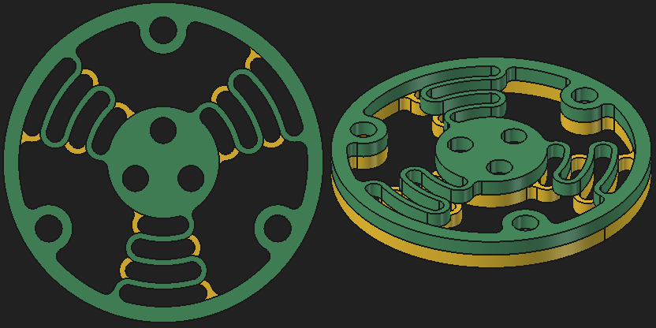
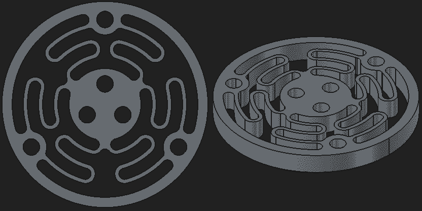

Spring Designs
==============

All springs come with a default height of 4mm.
If you want a thinner spring, use your slicer to cut down the height (use the scaling feature and click the padlock to scale height independent of width and length).

All designs come with variants for:
- Stem type (`original` three screws, `single-center-screw` triangle hole)
- Stem hole orientation (`flipped` for `Magnets-Holder-v2`, or unflipped)

See [Tips for experimenting](#tips-for-experimenting) at the end of this readme.

## Spacer

If you use a thinner spring, you must match the height with a spacer.
`spring` + `spacer` = 4mm.

## Original

The original spring design by [Salim Benbouziyane](https://github.com/sb-ocr/cad-mouse-mk2).

## Stacked

Print the original spring two times, with half the height (2x 2mm).
Mount them together, such that one side is flipped upside-down.

- Fixes rotation around Z-axis (both directions use the same force)
- Z-axis translation (pull up-/down) is softer (better with a lightweight base)

## Mirrored Double

Same as the `Stacked` variant above but in a single design.
Careful with the height: because this variant uses twice the amount of springs, a 2mm spring will be nearly as stiff as the 4mm `Original` spring.

## Tips for experimenting

- Spring height determines stiffness of the Z-axis.
  For example, with a 2mm spring, the up-/down motion is much easier.
  But on the other hand, tilting also becomes easier.
  E.g., translation on the X- and Y-axis becomes harder because each push may inadvertently rotate the scene.
  It is also a bit harder to rotate around the Z-axis in a steady motion.
- Thinner spring walls increase sensitivity in the X- and Y-axis.
  If you want to go below the 0.8mm in the original design, you'd need a finer nozzle (<0.4mm).
  (unless you are ok with just a single filament line).
- The hardest part, is to find a design which maps 3 springs on a 2-dimensional translation.
  All four XY directions should require the same amount of pressure (or at least: the two opposite directions should require the same force).
  E.g., pulling down on the "bottom" spring should compress equally as the other two springs pushing left- or right.
- If you go for a 6-spring design, try to place the outer-ring anchor points in 60° increments.
  This way, the spring is balanced equally in all four directions.
- Pay attention to spring direction.
  If all springs point in the same direction (like in the original design), rotation around the Z-axis will be easier in one direction than the other.
- When you find a good design, try the extremes.
  Rotate into corners where the spring may collide onto itself or onto the `Knob`.
  Add extra clearance to avoid rasping.
- Always try with the software in a test-scene.
  I had countless spring designs which felt good in a dry run (just the hardware haptics) but did not match my expectations when used in real software.

### Batch export

The Makefile is just a wrapper around `freecad -c export.py`
